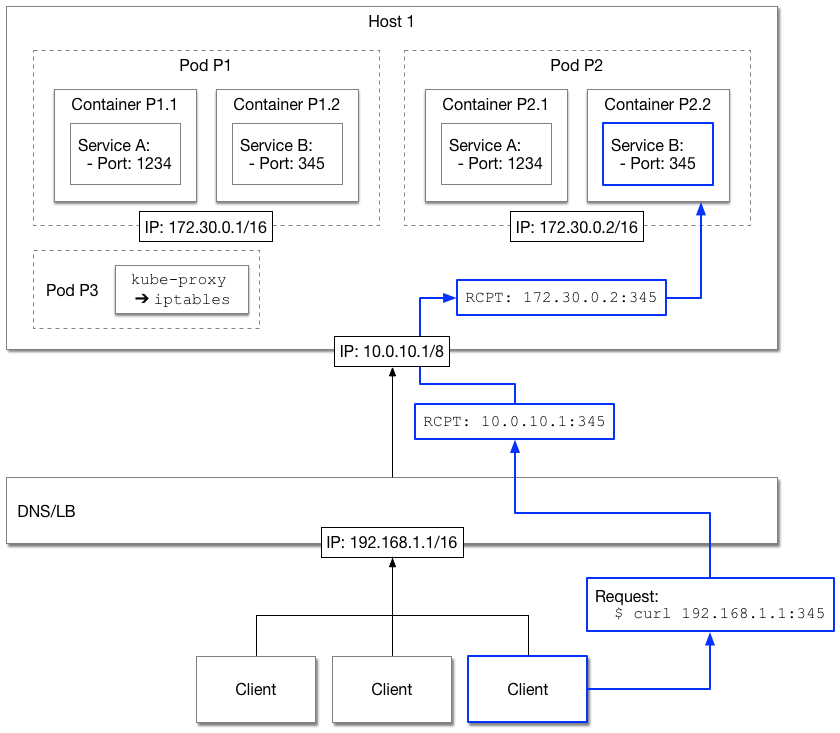

# IP Address Management

## Introduction

This document explains the handling of IP addresses in a CDAS cluster. There are
multiple levels of addresses that are usually managed in an automated fashion, but
sometimes it may be necessary to understand the inner workings in case something is not
working as expected. Also, this document discusses how services should be provisioned
through higher-level abstractions, providing a more robust access pattern in the
process.

## Overview

A CDAS cluster is commonly provisioned using an infrastructure service, such as Amazon
Web Service's EC2. The machines for the cluster are managed by the DeploymentManager,
which spins up new instances, or shuts them down at the end of the cluster lifecycle.
The IP addresses for each machine are assigned from the service pool, which for EC2 is
defined by *subnets* in a larger *VPC* context. These subnets, or ranges, are somewhat
fixed (often due to the complexity of managing them), and addresses are claimed and
released as nodes are started and terminated, respectively.

Once the nodes are up and running, the Deployment Manager (DM) will communicate with
the Kubernetes (K8s) service that is handling the deployment of software unto the
nodes. It is common that the DM is installing the K8s service itself, but with more
support of K8s by IaaS providers, this step may be skipped, given the nodes are already
part of a K8s cluster.

The DM will instruct K8s to deploy the services in *containers*, which are grouped into
*pods* as defined. Commonly, each pod is one container (plus an internal one, called
*pause* to keep the pod alive, even when the other container exits) and there is one
unique IP address assigned to each pod. [Internal IP Range](#internal-ip-range)
discusses the details.

Each service commonly listens to a network port, and K8s has an automated firewall
management built in (using `iptables`), which (optionally) checks for the *liveness* of
a service (by, for example, accessing the network port) and if the service is deemed
healthy, it opens access to all *exposed* ports (as per the service description,
provided as K8s YAML file) for the container IP address.

Part of K8s is the `kube-proxy` daemon (a background process) that handles the exposure
of services and their network ports at the host level. If a service is healthy and an
exposed port is available, the same port becomes available on all K8s cluster nodes.
In other words, all hosts are now proxying the service port and send every request to
the matching pod (read, container) on the node that runs the service. In other words,
all nodes can be used to access a service, while the `kube-proxy` is routing the
request to the appropriate physical machine.

With the nodes (referred to as *hosts*, *servers*, or *machines* interchangeably) up
and running, and all services started, the cluster is ready to serve requests. Before
we continue, here a diagram that shows what we just discussed, but extends on it with
topics we will discuss next:



## Internal IP Range

As mentioned, all pods in K8s are assigned an IP address from an internal range. CDAS
configures K8s to use the Weave CNI plugin to handle, among other things, the
assignment of addresses to pods. These addresses come from a range that defaults to
10.32.0.0/12, and is referred to as *CDAS Internal IP Range*.

In rare circumstances the internal IP range is already used for other services within
the CDAS cluster, like, for example, a management suite that is provisioned with the
cloud-based servers. If that happens, CDAS services may randomly fail to start, and
could end up with the CDAS services rendered inoperable. In that case, you need to
point the internal IP range to a different one. The range can be set as a CIDR using
the `CEREBRO_CDAS_INTERNAL_NETWORK_IP_RANGE` environment variable of the DM. See
the [Advanced Installations](AdvancedInstall.md#advanced-networking) document for
details on how to use that.

Given you have no IP address overlaps, the internal IP range is used by Weave on behalf
of K8s as expected, and service ports are exposed, as explained earlier, per pod and
host.

## Exposed Services

Exposing ports that way seems simple and straight forward. In fact, when you run the
`cerebro_cli clusters endpoints` command on the DM machine, you will see (something
similar to) the following:


```
{
    "cerebro_catalog:log-server": [
        "10.1.10.47:12213"
    ],
    ...
    "cerebro_worker:log-server": [
        "10.1.10.47:7928",
        "10.1.10.254:7928"
    ],
    ...
    "cerebro_worker:worker": [
        "10.1.10.47:13050",
        "10.1.10.254:13050"
    ],
    "cerebro_worker:webui": [
        "10.1.10.47:6074",
        "10.1.10.254:6074"
    ],
    ...
}
```

This list contains all hosts (in this example there are two) and the exposed ports, as
per the K8s definitions, for each service. You can see that for redundant services the
same port is exposed on more than one host, just as expected. If you were to use these
addresses and ports, you would get access to the services behind them just fine. But
that is **not** what is recommended you should do. For any administrator it should be
clear that exposing the IP addresses of a services directly to consumers is not
desirable. This is akin to handing out website URLs with IP addresses in them, where
every change of that address would yield the URL inoperable.

Instead, like for URLs, it is advised to hide the internal node IPs behind a common,
shared host name, using DNS to resolve the name to an IP address. Using *round-robin*
in DNS records with multiple "A" entries, your clients will be routed to one of the
many nodes that offer the service. The drawback here is that DNS is quite slow to
adopt to changes when servers fail or new ones join.

The best solution is to use a load balancer, such as, for example AWS Elastic Load
Balancing, which provide a much more advanced experience in handling dynamic membership
state. Combined with DNS to point to the load balancer's external IP address, you have
the most resilient and scalable setup to serve services to users.

The above diagram shows (in blue) how a request flows from the client across the
network (the shown example assumes the clients are in the same non-routable IP range
as the balancer, but of course clients could as easily be located in a different LAN)
and how the IP address changes for every layer.


